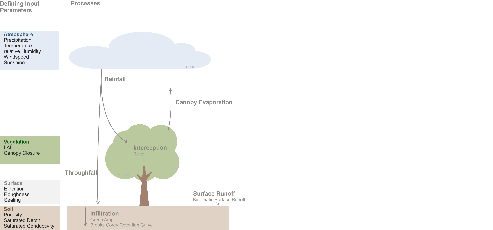

# LEAFlood utilizing the Catchment Modelling Framework (CMF)

## General description

The LEAFlood model is based on existing model components of the Catchment Modelling Framework (CMF). It is in between a conceptual and physically-based, distributed, deterministic model.
LEAFlood considers the hydrological processes of canopy interception, canopy evaporation, throughfall, soil infiltration and surface runoff. The geometry is created on the basis of an irregular polygon shapefile. The model is forced by meteorological data of rainfall, temperature, wind speed, relative humidity and solar radiation. 
The interception utilizes the Rutter approach. LAI, Interception capacity and canopy closure are required parameters. Depending on the canopy closure, the precipitation can either be intercepted in the canopy or fall directly to the ground. A canopy closure of 1 means all rain is intercepted and 0 indicates throughfall. The soil consists of one soil layer with the Green-Ampt infiltration method and the Brooks-Corey Retention Curve. A multi soil layer approach can be adapted. The saturated conductivity can be set individual for each cell. Further soil defining parameters are the porosity and the saturated depth. The surface runoff follows the kinematic approach based on topography and surface roughness (Manning’s roughness coefficient).

It is published as free software under [GPLv3](http://www.gnu.org/licenses/gpl.html). (c) 2022 by Thea Wübbelmann and Kristian Förster.

## How to install LEAFlood
Most [requirements](requirements.txt) are available in most Python setups. CMF is available through the Python Package Index. Further infomration on installing CMF is provided in the [CMF documentation](https://philippkraft.github.io/cmf/cmf_install.html). [LEAFlood.py](LEAFlood.py) includes both the model code (functions classes) and an example script. Thus, the file is executable.

## How to use LEAFlood
For simplicity, [LEAFlood.py](LEAFlood.py) includes both the model code and a simple example how to use the model. Relevant files provided alongside are:

* [GIS/sample.shp](GIS/sample.shp): A simple shape file including a cascade of three polygons. The lowermost polygon is the outlet (constant head boundary condition). The shape file - or more specifically the corresponding fields file [GIS/sample.dbf](GIS/sample.dbf) - includes all relevant fields required to run simulations with LEAFlood. The field names are self-explanatory, so it should be easy to prepare similar input files for own applications.

* [meteo/meteo.csv](meteo/meteo.csv): This file includes the meteorological forcing data (time series). Please note that the model codes expects the column names as indicated in this file. Following CMF definitions, rainfall is always provided in mm/d, even though the sub-daily time steps are used.

To run LEAFlood, you need to create a `Model` object first. The following is alist of arguments fro the `__init__`constructor method:

* `subsurface_lateral_connection`: CMF lateral connection type for subsurface flow, e.g. `cmf.Darcy`.

* `surface_lateral_connection`: CMF lateral connection type for subsurface flow, e.g. `cmf.KinematicSurfaceRunoff`.

* `layercount`: `int` variable that denotes the number of vertical soil layers, e.g., 1.

* `in_shapefile`: `string` that points to the shape file to be read.

* `meteo_data`: file that includes time series data / meteorological forcing (`string`)

* `begin`: time stamp that indicates when the simulation starts (`cmf.Time`)

* `timestep`: time step of the model in terms of input and output (the numerical scheme of CMF might introduce sub time steps), which can be provdided in terms of CMF time units, e.g., `cmf.min*10` would indicate a 10 minutes time step.

* `station_name`: name of the meteorological station (`string`)

While the former values are mandatory, the subsequent list could be refined later:

* `initial_waterlevel`: initial water level of swales (`float`), e.g., 0.0 m

* `init_sat_depth`: initial value of saturated depth (e.g. vertical distance between surface and groundwater level) to initialise matrix potential in the soil layer(s), e.g., 1.0 m (`float`).

* `n`: porosity of the soil as fraction (`float`), e.g., 0.4.

* `param_b`: parameter *b* of the Brooks Corey retention curve (`float`), e.g., 6.0

*  `theta_x`: a parameter to tweak the shype of the Brooks-Corey retention curve (`float`) - volumetric soil moisture that corresponds to a pF value of 2.5. The default is 0.2, for more details, please refer to the [CMF documentaion](https://philippkraft.github.io/cmf/classcmf_1_1upslope_1_1_brooks_corey_retention_curve.html).

* `n_decay`: porosity decay (`float`), see [CMF documentaion](https://philippkraft.github.io/cmf/classcmf_1_1upslope_1_1_brooks_corey_retention_curve.html)

* `scale_nman`: scale factor multplied with Manning's roughness values for each polygon in the shape file (`float`), default is 1.0.

* `scale_k`: scale factor multplied with saturated hydraulic conductivity values for each polygon in the shape file (`float`), default is 1.0.

* `no_tree`: switch (`bool`) to ignore trees in simulation, according to Camarena et al. (2022), default is `False` in order to account for trees.

* `verbose`: switch (`bool`) whether the model prints everything to the screen (recommended for testing)

Other relevant functions are:

* `run2()`: this function calls the simulation. Returns a list of `pandas.DataFrames` (time series for each polygons) with the same definitons like the files written via `export_results` (see below, first data frame is outflow at outlets). Arguments:

 * `start`: `cmf.Time` indicates time when simulation starts (default `None` suggest auto-detection)

 * `start`: `cmf.Time` indicates time when simulation ends (default `None` suggest auto-detection)

 * `step`: time step of simulation, e.g. `cmf.min*10`

 * `verbose`: whather to print each time step to the screen (`bool`)

 * `export_results`: whether to export time series of state variables and fluxes for each polygon to excel spread sheets (`bool`). If activated (i.e., `True`), a folder `output` is created (if necessary) and time sreis are created for the following variables (n.b., columns are time dimension, while rows refer to polygons to make it GIS compatible): Intercepted water (mm), soil water contant (mm), surface water depth (mm), used soil water capacity (fraction), and water balance at outlets, i.e., the outflow at outlet locations (m3/d accoring to CMF specifications). Time dimension is given in terms of running numbers. Use `get_time_dim()` in order to relate it to time steps. 

* `get_time_dim()`: function that returns a `pandas.TimeStamp` index for plotting purposes (relate columns in results files to time stamps).

The `__main__` section of [LEAFlood.py](LEAFlood.py) includes a minmal example that utilises both the function just described and the sample files.

## Publications
Camarena, K.; Wübbelmann, T; Förster, K. 2022: Each urban tree retains one cup of coffee per second – A hydrological modelling case study in Vauban, Freiburg (Germany). *Hydrology*, Submitted.

## CMF Publications
Documentation: [https://philippkraft.github.io/cmf/](https://philippkraft.github.io/cmf/)

Github: [https://github.com/philippkraft/cmf](https://https://github.com/philippkraft/cmf) 
